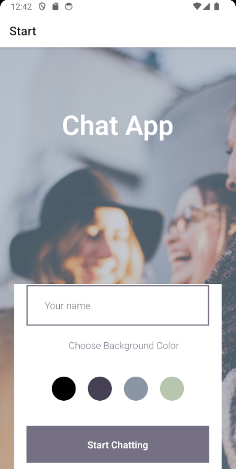
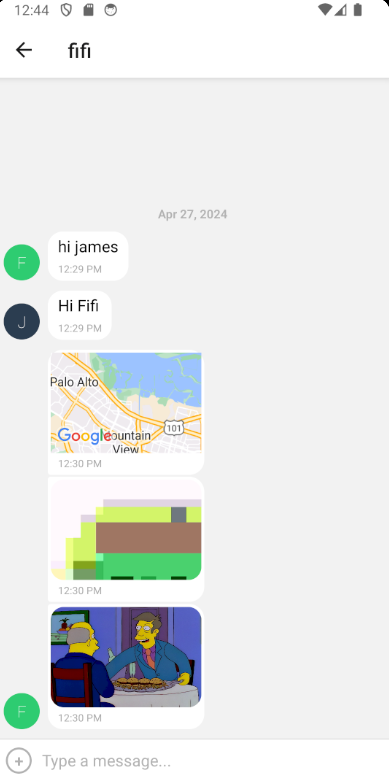

<h1>Chat App<h1>

This is a chat application built using React Native and Cloud Firestore for storage. It was tested and developed with Android Studio and the Expo Go app.
 

 

<h2>Features<h2>

Users will be able to do the following with this app:
<ul>
<li>Sign in</li>
<li>Change the background color of the chat screen</li>
<li>Send and receive messages</li>
<li>Take photos using the device's camera</li>
<li>Send photos from the device's gallery</li>
<li>Send the location of the user providing a map view</li>
<li>Messages are stored in a Firestore database where they can be retrieved in real time when the user's device is online</li>
<li>Messages are stored asynchronously on the user's device so that the user still has access to their messages when offline</li>
</ul>

<h2>Setup<h2>

This app uses the following libraries, frameworks and platforms:
<ul>
<li>React Native</li>
<li>Gifted Chat</li>
<li>NetInfo</li>
<li>AsyncStorage</li>
<li>React Native Maps</li>
<li>Expo</li>
<li>Expo Go</li>
<li>Expo Image Picker</li>
<li>Expo Location</li>
<li>Google Cloud Firestore</li>
<li>Android Studio</li>
</ul>

To use this app, do the following:
<ul>
<li>Clone this repository on GitHub</li>
<li>Set up a Firestore database, changing the read/write permissions to "true"</li> 
<li>In the database, change the read/write permissions to "true"</li>
<li>Replace the Firebase configuration with the keys from you database in the App.js file</li>
<li>Install Android Studio and configure it to set up the type of device you want to use</li>
<li>Install and run Expo using "expo start" or "npm start" (or "npx expo start")</li>
</ul>

